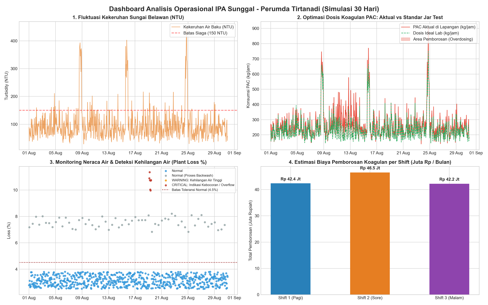

# Halo, Saya Kalek
### Mahasiswa Informatika (PJJ) Universitas Insan Cita Indonesia (UICI)
**Data Analyst | Data Administrator | Business Intelligence**

 

> *"Mengubah data operasional mentah menjadi efisiensi biaya, kontrol kualitas, dan keputusan berbasis data."*

> ## Note:
> Seluruh data operasional yang disajikan dalam portofolio ini merupakan model data sintetis 30 hari yang saya kembangkan untuk kebutuhan simulasi analisis data, automasi ETL, dan evaluasi efisiensi operasional. Proyek ini tidak menggunakan ataupun mempublikasikan data internal rahasia Perumda Tirtanadi.

---

## ℘ Tentang Saya & Tujuan Magang

Saya adalah mahasiswa aktif semester 6 Program Studi Informatika (PJJ) di **Universitas Insan Cita Indonesia (UICI)** dengan dedikasi tinggi dalam pengolahan data, automasi ETL, dan analisis bisnis operasional.

Saya memiliki pemahaman mendalam dalam pemodelan database relasional atau SQL, manipulasi time series dengan Python Pandas, data quality profiling, serta visualisasi data bisnis berbasis standar industri data analytics. 

**Tujuan Penempatan Magang:**
Mengimplementasikan keahlian data analytics dan data administration untuk mendukung operasional Perumda Tirtanadi khususnya Instalasi Pengolahan Air (IPA) Sunggal, Medan pada bidang:
1. Rekonsiliasi Neraca Air & Deteksi Dini Kehilangan Air Internal Plant Water Loss.
2. Efisiensi & Optimasi Anggaran Bahan Kimia Penjernih Air (PAC/Koagulan) Berbasis Fluktuasi Kekeruhan Sungai Belawan.
3. Automasi ETL Rekonsiliasi Logbook Harian Laboratorium Dari Spreadsheet Manual Ke Sistem Basis Data Terintegrasi.

---

## ℘ Keahlian & Teknologi Data

  
  
  
  

- **SQL Relational & Data Extraction:** Menguasai fungsi skalar teks, agregasi multi-dimensi (`GROUP BY`, `HAVING`), multi-table join (`INNER JOIN`, `LEFT JOIN`, `UNION`), dan `Subquery` untuk analisis tren bulanan serta filtering anomali.
- **Python for Data Analysis (Pandas & NumPy):** Transformasi data ETL, imputasi missing values, pengelompokan time series deret waktu per jam/shift kerja, manipulasi tanggal, serta deteksi outlier dengan metode IQR.
- **Data Quality & Business Acumen:** Menerjemahkan kebutuhan manajemen teknis dan non-teknis ke metrik performa terukur (*Loss Percentage*, *MoM Growth*, *Unit Cost per m³*, *Chemical Dosage Optimization*).
- **Spreadsheet & Administration:** Standardisasi formulir input, validasi integritas data, dan otomasi pelaporan harian/bulanan.

---

## ℘ Proyek Kasus Riil Pengolahan Air

### Proyek 1: Analisis Neraca Air & Deteksi Air Terbuang Atau Disebut Plant Loss Di IPA Sunggal
*Teknologi: Python (Pandas Time-Series), SQL (Subquery & Joins), Matplotlib*

* **Latar Belakang:**  
  IPA Sunggal menyedot air baku dari Sungai Belawan dengan debit masukan mencapai ~8.700 m³/jam (~2.400 L/detik). Jika terjadi kebocoran internal atau overflow bak reservoir di luar batas wajar (3–5%), Perumda Tirtanadi menanggung risiko kerugian ganda berupa air bersih yang terbuang dan pemborosan listrik pompa transmisi.
* **Metode & Eksekusi Data:**
  - Melakukan simulasi dan ekstraksi logbook 720 jam operasional (30 hari).
  - Mengisolasi penurunan debit normal akibat pencucian saringan pasir cepat yang rutin terjadi 2x sehari.
  - Membangun algoritma untuk mendeteksi deviasi kritis (Loss > 5.0%) di luar siklus pencucian saringan.
* **Hasil & Dampak Bisnis:**
  - Berhasil mendeteksi anomali kebocoran kritis sebanyak **7 jam operasional** yang tidak teridentifikasi pada laporan agregasi harian manual biasa.
  - Memberikan sinyal peringatan dini untuk tim seksi pemeliharaan guna mencegah plant loss berkepanjangan.

---

### ℘ Proyek 2: Optimasi Dosis Koagulan PAC vs Kekeruhan Sungai Belawan
*Teknologi: SQL Aggregation, Python Pandas Binning, Business Translation*

* **Latar Belakang:**  
  Kekeruhan air Sungai Belawan sangat fluktuatif (sering melonjak dari 40 NTU hingga >300 NTU saat curah hujan hulu tinggi). Di lapangan, penentuan dosis kran koagulan (PAC) berisiko boros anggaran dan residu kimia atau air olahan keruh.
* **Metode & Eksekusi Data:**
  - Mengelompokkan data kekeruhan menjadi 4 kategori: Rendah (<50 NTU), Sedang (50–150 NTU), Tinggi (150–300 NTU), dan Ekstrem (>300 NTU).
  - Menghitung standar dosis ideal berdasarkan acuan kurva laboratorium dalam satuan industri (ppm = gram/m³).
  - Mengkalkulasi selisih konsumsi harian dan mengalikan dengan harga bahan kimia industri (Rp 6.500/kg).
* **Hasil & Dampak Bisnis:**
  - Mengidentifikasi inefisiensi dosis koagulan sebesar **20.165 kg PAC/bulan** dengan potensi penghematan biaya produksi mencapai **Rp 131.074.515/bulan**.
  - Mengungkapkan bahwa **Shift 2 Sore** memiliki deviasi dosis berlebih tertinggi (Rp 46,5 Juta), yang menjadi dasar rekomendasi perbaikan kalibrasi kran berkala dan briefing kepatuhan SOP Jar Test bagi operator shift.

---

### ℘ Proyek 3: Automasi ETL Rekapitulasi Logbook Operasional Lapangan
*Teknologi: Python (read_excel / to_sql), SQLite, Data Cleaning*

* **Latar Belakang:**  
  Pencatatan data kualitas air (pH, NTU, sisa klorin, jam operasional pompa) di instalasi sering tersebar di berbagai lembaran formulir Excel per seksi dengan format teks yang beragam dan sel kosong atau missing values.
* **Metode & Hasil:**
  - Membangun skrip pipeline Python untuk standardisasi format jam/tanggal, pembersihan spasi liar, dan penanganan nilai kosong.
  - Memangkas waktu penyusunan rekapitulasi laporan bulanan dari hitungan hari menjadi **kurang dari 30 detik**, meminimalkan risiko human error dalam pelaporan data ke divisi pengolahan pusat.

---

## ℘ Kontak & Komunikasi

- **Nama:** Kalek
- **Kampus:** Universitas Insan Cita Indonesia (UICI) - PJJ Informatika
- **Email:** [bobosss@gmail.com](mailto:bobosss@gmail.com)
- **LinkedIn:** [Profil LinkedIn](https://linkedin.com/in/kalek)
- **GitHub:** [github.com/boboj1597-png](https://github.com/boboj1597-png)
- **Lihat Portofolio Lengkap Saya**: https://boboj1597-png.github.io/portofolio-data-tirtanadi/
- **Berkas Lamaran Magang**: lihat folder [`lamaran-magang/`](lamaran-magang/) untuk template surat, CV, dan proposal.

